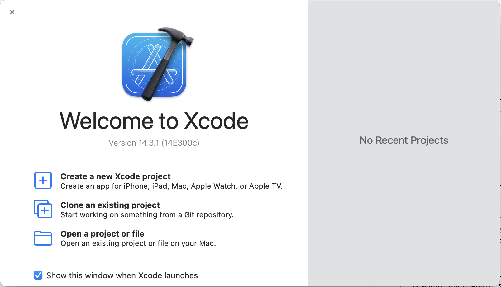

# Tool Chain

::: {.callout-warning}
## Work in Progress
:::

## R installieren

::: {.callout-warning}
## MacOS
Viele R-Bibliotheken benötigen zusätzliche Komponenten, damit sie funktionieren. Diese Komponenten müssen zusätzlich *kompiliert* werden. Unter MacOS benötigt R dafür die App **XCode** und die **XCode Command Line Tools**.

Beide Teile stehen unter MacOS kostenlos zur Verfügung. XCode wird wie gewohnt über Apple's AppStore installiert. Nach der Installation muss XCode einmal gestartet werden, um die Lizenzbedingungen zu akzeptieren. Anschliessend sollten die notwendigen Ergänzungen für die Entwicklung unter MacOS installiert werden.

DIALOG

Nach erfolgreicher Installation erscheint eine Abfrage, zum Starten eines neuen Projekts (@fig-xcode-start).

{#fig-xcode-start}

```bash 
xcode-select --install
```


:::


## R-Bibliotheken installieren

```r
install.packages(package_name)
```

::: {#exm-install-packages}
## Installieren der tidyverse-Bibliotheken
```r
install.packages("tidyverse")
```
::: 


### pak

### tidyverse

## IDE

### RStudio

### VS Code

### Jupyter Notebook
