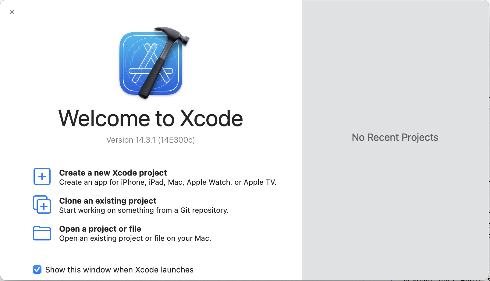
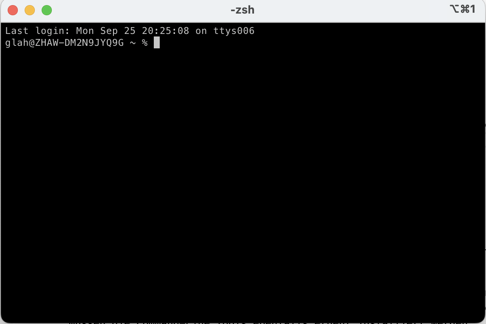

# Tool Chain

## R installieren

Die Installation von R ist einfach. Auf der [R-Project](https://cran.r-project.org/) Webseite kann das Installationspaket für das jeweilige Betriebssystem heruntergeladen werden. Die Installation erfolgt wie gewohnt über den Installer.

::: {.callout-warning}
## MacOS
Viele R-Bibliotheken benötigen zusätzliche Komponenten, damit sie funktionieren. Diese Komponenten müssen zusätzlich *kompiliert* werden. Unter MacOS benötigt R dafür die App **XCode** und die **XCode Command Line Tools**.

Beide Komponenten stehen unter MacOS kostenlos zur Verfügung. XCode wird wie gewohnt über Apple's AppStore installiert. Nach der Installation muss XCode einmal gestartet werden, um die Lizenzbedingungen zu akzeptieren. Anschliessend sollten die notwendigen Ergänzungen für die Entwicklung unter MacOS installiert werden.

Nach erfolgreicher Installation erscheint eine Abfrage, zum Starten eines neuen Projekts (@fig-xcode-start).

{#fig-xcode-start}

Damit ist die Installation von *XCode* abgeschlossen. Nun folgt die Installation der Kommandozeilenwerkzeuge. Dazu muss ein Terminal geöffnet werden.

{#fig-terminal-macos}

Im Terminal muss das folgende Kommando eingegeben und anschliessend mit der Eingabe-Taste abgeschlossen werden. 

```bash 
xcode-select --install
```

Anschliessend folgen mehrere Abfragen zur Installation der XCode-Command-Line Komponenten. Nach der Installation kann das Terminal und XCode wieder geschlossen werden.

XCode wird regelmässig grösseren Änderungen unterzogen. Diese Änderungen erfolgen oft im April, Juni und September. Nach einem Update von XCode müssen die Command-Line Tools ebenfalls erneut installiert werden. Ausserdem ist es notwendig, dass die Lizenzbedingungen erneut akzeptiert werden, sonst lassen sich R-Bibliotheken nicht mehr kompilieren. 
:::

### Überprüfen der Installation

Nach erfolgreicher Installation sollte R mit den Werkzeugen der Laufzeitumgebung auf dem Rechner vorhanden sein. Die Installation lässt sich mithilfe des Terminals (MacOS) oder der Powershell (Windows) überprüfen. 

::: {.callout-warning}
## MacOS vs. Windows

Unter MacOS muss der folgende Befehl eingegeben und mit der Eingabe-Taste abgeschlossen werden. 

```bash
Rscript -e 'sessionInfo()'
```

In der Windows Powershell muss der Befehl wie folgt aussehen: 

```powershell
RSCRIPT.EXE -e 'sessionInfo()'
```
:::

Bei erfolgreicher Installation erscheint eine Meldung im Terminal, die der folgen Meldung ähnelt. Die Funktion `sessionInfo()` zeigt die VersionsInformation der aktuellen R-Installation an.

```
R version 4.3.1 (2023-06-16)
Platform: aarch64-apple-darwin22.4.0 (64-bit)
Running under: macOS Ventura 13.5.2

Matrix products: default
BLAS:   /opt/homebrew/Cellar/openblas/0.3.23/lib/libopenblasp-r0.3.23.dylib 
LAPACK: /opt/homebrew/Cellar/r/4.3.1/lib/R/lib/libRlapack.dylib;  LAPACK version 3.11.0

locale:
[1] de_DE.UTF-8/de_DE.UTF-8/de_DE.UTF-8/C/de_DE.UTF-8/de_DE.UTF-8

time zone: Europe/Zurich
tzcode source: internal

attached base packages:
[1] stats     graphics  grDevices utils     datasets  methods   base     

loaded via a namespace (and not attached):
[1] compiler_4.3.1
```

### Erste Schritte

R ist eine *interaktive Sprache* und besteht im Kern aus einer sog. Laufzeitumgebung. Diese Umgebung übersetzt R-Syntax in Maschinensprache und führt vollständige *Ausdrücke* direkt aus. Innerhalb der Laufzeitumgebung steht ein einfacher Zeileneditor zur Verfügung, mit dem Eingaben erstellt und manipuliert werden können. 

::: {.callout-warning}
## MacOS vs Windows
Die R-Laufzeitumgebung wird auf MacOS-Systeme im Terminal mit dem Kommando `R` und Eingabetaste gestartet. 

Auf Windows-Systemen wird die Laufzeitumgebung in der Powershell mit dem Kommando `R.EXE` aufgerufen.
:::

R verwendet für alle Operationen **Funktionen**. Die meisten R-Funktionen haben einen Namen und werden mit runden Klammern aufgerufen. Ein Beispiel ist die Funktion `quit()`, mit der die R-Laufzeitumgebung verlassen wird. Funktionen werden in die Laufzeitumgebung eingegeben und durch das Drücken der Eingabetaste ausgeführt.

```r
quit()
```

Dieser Funktionsaufruf führt zu der Abfrage, ob die aktuelle Arbeitsumgebung gesichert werden soll. 

```
Save workspace image? [y/n/c]:
```

Weil nichts geändert wurde, kann diese Frage mit `n` für *No* beantwortet und mit einem Druck auf die Eingabetaste übergeben werden. Anschliessend wird die Laufzeitumgebung geschlossen und kehrt auf die Kommandozeile des Betriebssystems zurück.

Neben der interaktiven Laufzeitumgebung wird R mit dem Programm `Rscript` ausgeliefert. Mit `Rscript` können Dateien mit R-Code zusammenhängend ausgeführt werden. 

::: {#def-r-script}
Ein **R-Script** ist eine Datei, die nur R-Code enthält. Ein R-Script hat per *Konvention* die Dateiendung `.r`
:::


::: {.callout-warning}
## MacOS vs. Windows
Das Programm `Rscript` heisst unter Windows `RSCRIPT.EXE`. 
:::

::: {#exm-r-script-call}
## Ausführen eines R-Scripts im MacOS Terminal
```bash
Rscript my-rscript.r
```
:::

`Rscript` kann ausserdem einzelne Code-Zeilen ausführen, ohne in die interaktive Laufzeitumgebung wechseln zu müssen. Diese Funktion ist praktisch, um eine einfache Operation auszuführen, wie z.B. eine Bibliothek zu installieren (s. @sec-install-libs). 

## Grafische Oberflächen für R

R hat keine eigene grafische Benutzeroberfläche und ist auf eine externe Entwicklungsumgebung angewiesen. Eine solche Entwicklungsumgebung muss zusätzlich zu R installiert werden, damit die Programmierung und die Analyse vereinfacht wird. Die am häufigsten eingesetzten Entwicklungsumgebungen für R sind:

- RStudio
- Jupyter Notebooks
- Visual Studio Code

::: {.callout-note}
In diesem Buch wird Visual Studio Code für alle Beispiele mit Benutzeroberfläche verwendet. Die Bedienung von RStudio oder JupyterLab unterscheidet für die Arbeit in diesem Buch sich nur marginal von Visual Studio Code.
:::

Eine R-Entwicklungsumgebung ist unabhängig von der R-Laufzeitumgebung, die die Programmiersprache bereitstellt. Es ist also möglich, R-Programme in der einen Umgebung zu entwickeln und später in einer anderen weiterzubearbeiten und auszuführen.

Die Grundkomponenten einer Entwicklungsumgebung sind immer gleich ([@fig-ide-components]): 

- Code-Editor, mit dem Dokumentation und analytische Funktionen geschrieben werden. 
- Datei-Browser, über den alle Dateien eines Projekts verwaltet werden können.  
- Laufzeit-Console, über die die R-Laufzeitumgebung zugänglich ist. 
- Datenbetrachter, zur Auswertung von generierten Datenstrukturen. 
- Visualisierungsbetrachter, zur Anzeige von Datenvisualisierungen.

{#fig-ide-components with=100%}

Neben diesen Komponenten existieren oft zusätzliche Werkzeuge und Ansichten. 

- Werkzeuge zur Versionierung von Code und Daten.
- Dokumentation für R und ergänzende Bibliotheken.
- Installationsunterstützung von Bibliotheken.

### RStudio

RStudio ist eine integrierte Analyseumgebung, die speziell für die Entwicklung von R-Programmen und R-Analysen entwickelt wurde. Das System ist auf R-spezifische Arbeitsabläufe zur Datenanalyse ausgerichtet und unterstützt neben R auch die Programmiersprache Python.

RStudio verwendet eine spezielle Version von Markdown, um R-Code-Fragmente auszuführen und die Ergebnisse in das Dokument einzubinden. Dieses Format heisst R-Markdown.

Von RStudio existiert auch eine Web-basierte Version, welche online Zusammenarbeit und online Publikationen unterstützt. 

### JupyterLab

JupyterLab ist eine Web-basierte Analyseumgebung, die ursprünglich für die Programmiersprache Python entwickelt wurde. JupyterLab wurde speziell für Datendokumente entwickelt und unterstützt ausschliesslich Jupyter Notebooks als Austauschformat für Analysen.

JupyterLab unterstützt neben Python viele andere Programmiersprachen. Dazu gehört auch R. JupyterLab integriert Programmiersprachen durch spezielle *Kernel*, die Code-Fragmente auswerten und die Ergebnisse in ein Datendokument einbinden. 

In der Praxis werden Jupyter Notebooks und JupyterLab oft eingesetzt, wenn sehr umfangreiche Daten analysiert werden sollen, die nicht ohne weiteres über das Internet übertragen werden können oder dürfen.

### Visual Studio Code

Visual Studio Code ist ein kostenloser Code-Editor mit vielen Erweiterungen für fast alle Programmiersprachen und Arbeitsumgebungen. Die Erweiterung für R ist ebenfalls kostenlos und kann über den Extension Manager installiert werden.

Im Gegensatz zu R-Studio ist Visual Studio Code in erster Linie ein Code-Editor und bietet für R eine vergleichsweise einfache Entwicklungsumgebung. Der grösste Unterschied zwischen Visual Studio Code und RStudio oder JupyterLab ist der wenig differenzierte Variablen-Inspektor. 

In Visual Studio Code lassen sich u.a. auch R-Markdown-Dokumente und Jupyter Notebooks bearbeiten.

## R-Bibliotheken installieren {#sec-install-libs}

R verfügt über einen sehr grossen Fundus an Lösungen für das statistische Rechnen. Diese Lösungen werden als Bibliotheken bereitgestellt und über das *Comprehensive R Archive Network* (CRAN) geteilt. CRAN ist ein integraler Bestandteil von R. Weil R jedoch über sehr viele Bibliotheken verfügt, werden diese nicht mit R ausgeliefert, sondern müssen bei Bedarf installiert werden. Hierzu liefert R die Funktion `install.packages()` mit. Diese Funktion teilt R mit, eine Bibliothek mit einem bestimmten Namen zu installieren. 

::: {#exm-install-packages}
## Funktions-Schema von `install.packages()`
```
install.packages(package_name)
```
:::

In diesem Buch werden neben den R-Basisfunktionen fast ausschliesslich die Funktionen der `tidyverse`-Bibliothek behandelt. Die `tidyverse`-Bibliothek erweitert die R-Syntax um moderne Sprachkonzepte und vereinheitlicht viele Funktionen für Standardaufgaben. 

::: {.callout-note}
Streng genommen ist die `tidyverse`-Bibliothek eine R-Bibliothek im engeren Sinn. Vielmehr vereint sie die häufig zusammen eingesetzten Biblliotheken `ggplot2` ([@sec-chapter-daten-visualisieren]), `dplyr` ([@sec-chapter-indizieren-gruppieren]), `tidyr` ([@sec-chapter-daten-formen]), `readr` ([@sec-chapter-daten-importieren]), `stringr` ([@sec-chapter-zeichenketten]), `forcats` ([@sec-chapter-faktoren]), `lubridate` und `purrr` ([@sec-chapter-variablen]) sowie etliche weitere Module für die tägliche Arbeit mit Daten.
:::

Weil die `tidyverse`-Bibliothek eine zentrale Bedeutung im R-Umfeld hat, ist es an dieser Stelle sinnvoll, die `tidyverse`-Bibliothek mithilfe von `Rscript` zu installieren.

::: {#exm-install-packages-via-rscript}
## Installieren der tidyverse-Bibliotheken unter MacOS
```bash 
Rscript -e 'install.packages("tidyverse")'
```
:::

Bei der ersten Installation einer Bibliothek fragt R nach einem CRAN-Mirror. Hier sollte ein geografisch nahe Quelle gewählt werden, um die Ladezeiten zu verringern.

Mit Visual Studio Code können R-Bibliotheken auch mit der Arbeitsumgebung installiert werden. Dazu wird die R-Erweiterung geöffnet und im Bereich `Help Pages` die Option `Install CRAN Package` gewählt. Anschliessend wird der gewünschte Bibliotheksname in der interaktiven Suche eingegeben und mit der Eingabetaste ausgewählt (@fig-r-install-tidyverse).

{#fig-r-install-tidyverse}
